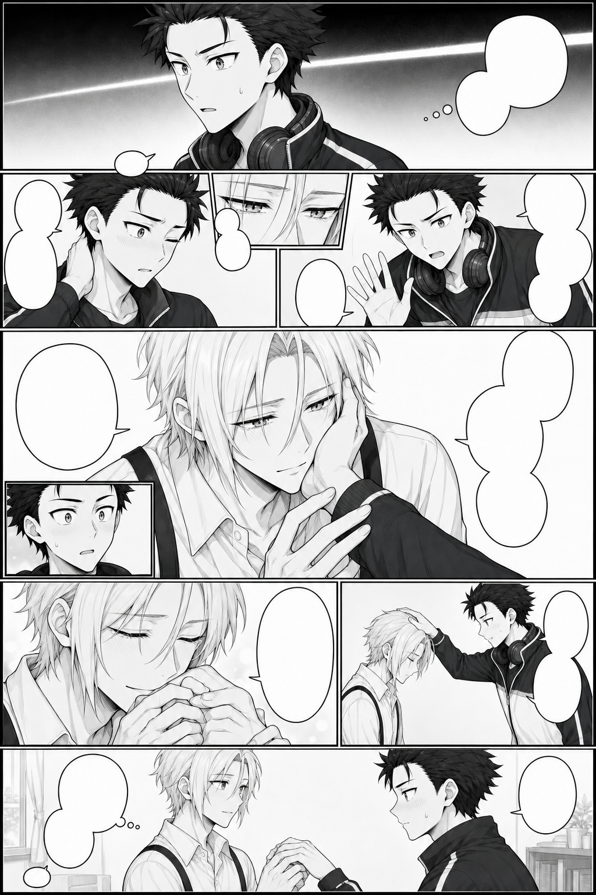
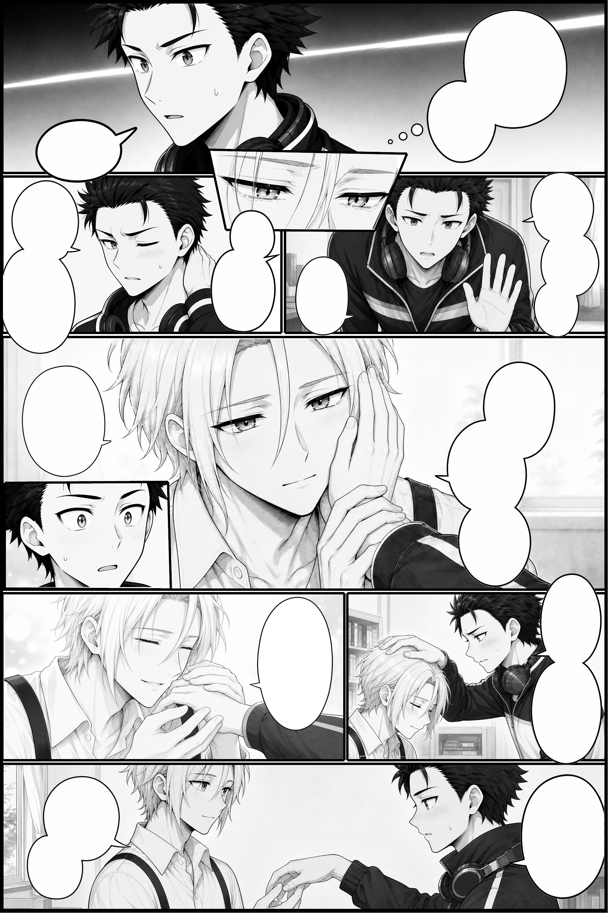

# P09：复杂分镜与修订经验

P09 用于观察大主格、微格、手部交互、取景和气泡遮挡。它采用历史空白气泡与整页填词路线，正式成品还包含创作者的人工修复。

## 台词改动如何连接后续页面

初始台词请求后的会话中断，现有来源未找到对应初稿回复。后续两句修订及实际回复可以作为可追溯的起点。

创作者 · 原文：

> 我就只修改两句：
> 16.“......笨蛋，我们约定过的吧。”
> 17.”再说了我不是都说过会回来的吗。“
> 其他的我觉得都挺不错的，修改16句主要是为了给后面的剧情埋伏笔

ChatGPT · 原文：

> 好嘞老大。我继续按漫画单页制作 skill 来处理：把第 16、17 句替换为这组“约定”伏笔，其余台词原样锁定，并把 P09 文字稿更新成正式候选版。

按序号指定两句改动，其他台词保持原样。后面的页面围绕这处已确认文字继续设计。

## 每格来源与框架分开

P09 的框架选第三版；9 个内容候选为 A03、B04、C03、D01、E06、F03、G06、H04、I03。分别记录来源后，再逐格重绘完整原图。

练习工程保留 9 个分镜与 13 个空白气泡。原图和遮罩分开，可以移动取景，完整保留被微格暂时盖住的内容。

## 手部交互与人工修复

这一页的手部曾经历多次调整。创作者明确了手的归属、接触位置和手指朝向，最后对部分分镜手动精修。练习包采用已确认的原图，保留其完整尺寸与字节。

这类问题可先描述每个人的左右手、手腕入口、接触的手掌或指尖，以及哪些部位被遮挡。遇到反复失败时，选择更明确的参考、经确认的简化动作或人工修复。将被用户接受的文件单独记录。

## 空白气泡与带字对象的演进

P09 的 13 个素材是空白气泡，历史成品上的文字来自之后的整页填词与人工修复。练习中的新版渲染因此显示空白气泡。

P09 还遇到整页填词删除微格的问题。P10 随后把最终文字与气泡一次生成，作为独立对象装配；修改一组文字时保留已经接受的画面。

## 练习主格和微格关系

从 `projects/start.json` 另存工作副本。先调整一格的原图取景，再把一枚气泡设为整页自由，移到主格与微格交界处，分别体验位于小格前面和后面的效果。

范围控制显示区域，前后遮挡控制与特定小格的关系。启用自动调层时，编辑器寻找当前气泡最近的合法层级，保留其他对象相互顺序。根据状态栏回执检查实际结果，并用撤销返回上一步。

## 输出像素与历史成品

历史正式母稿为 1024×1536。本次新版参考工程以 2× 渲染，输出为 2048×3072。它用于验证工程取景、气泡与边界；源图像素不足的提示保留在质量记录中。

提高倍率让导出直接利用原素材，已有低清细节仍受源文件限制。对照图像实际尺寸和告警，选择适合自己素材的倍率。

[返回快速操作](../../guide/quick-start.md) · [素材使用说明](../../ASSET-TERMS.md)。
