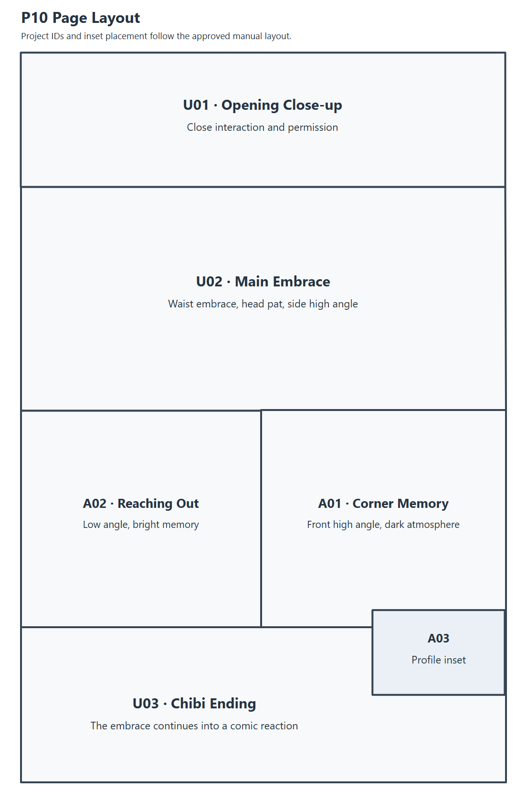
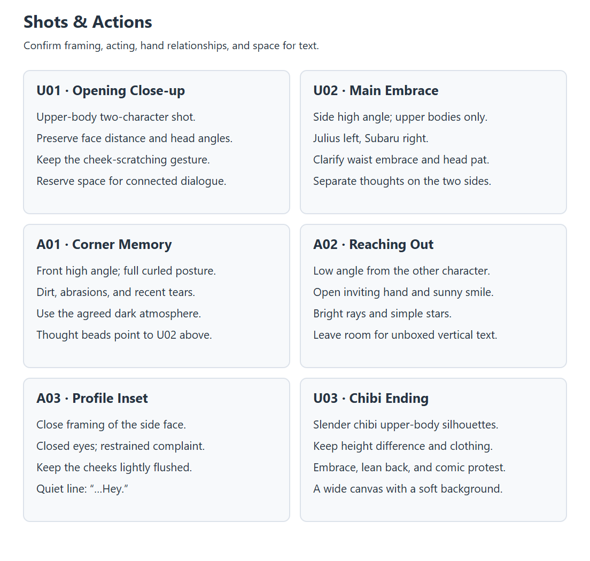
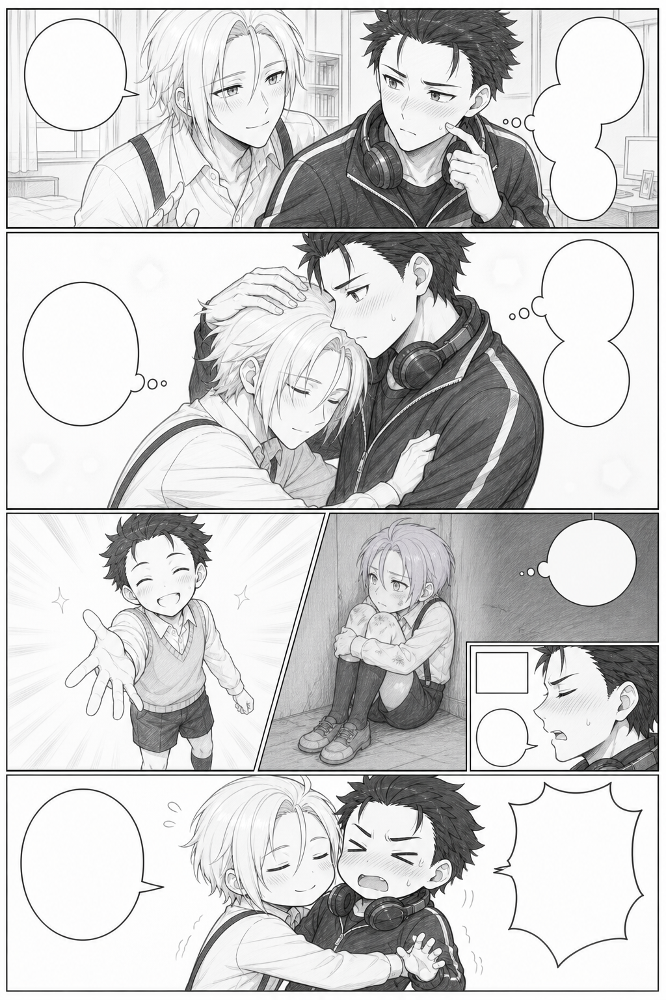
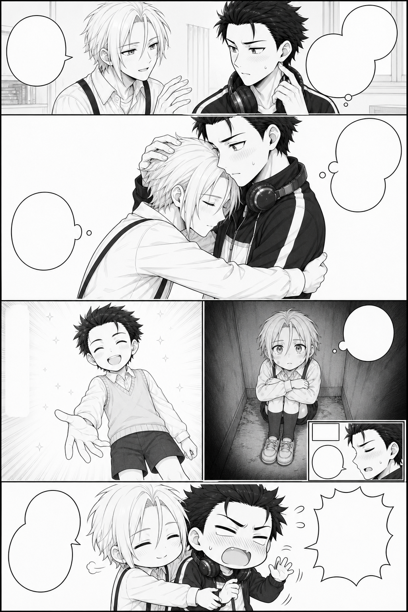

# P10: From Dialogue to a Finished Page

[中文](full-workflow.md) | [English](full-workflow.en.md)

This chapter follows the complete collaboration: the creator's request, ChatGPT's interpretation, revisions, and the resulting assets. Historical dialogue appears in English translation, with each Chinese original available below it. Translations explain the meaning; the Chinese source text and model prompts retain their original wording and punctuation. For hands-on editing with existing assets, start with the [quick exercise](../../guide/quick-start.en.md).

The workflow is **Compose → Separate → Assemble**. A whole-page draft establishes reading structure; selected panel crops guide independent finished artwork and lettered objects; local assembly brings them together. A retry affects its own asset while accepted work stays available. Less whole-page regeneration reduces opportunities for unrelated blur, blotches, or drift during lettering and detail edits. Selection, refinement, manual adjustment, and review determine the final result.

## 1. Refine the dialogue first

Establish each line's wording, speaker, and emotion before drawing.

Creator · English translation:

> Let's start the P10 dialogue draft from our script. Please write the first version, and we'll refine it together afterwards.

Chinese original

> 好的，现在按照我们的剧本开始P10的台词稿设计吧。请你先写出第一版，我们后续来慢慢修改

ChatGPT · English translation of an excerpt:

> Here is the first dialogue draft:
>
> 1. Subaru: “…All right.”
> 2. Subaru: “But only five minutes.”
> 3. Subaru: “Don't push your luck.”
> 4. Julius: “Thank you, Subaru.”
> 5. Subaru, thinking: “…Here we go again.”
> 6. Subaru, thinking: “Whenever he makes that face,”
> 7. Subaru, thinking: “I remember that time.”
> 8. Subaru, thinking: “…What a headache.”
> 9. Narration: “Five minutes later.”
> 10. Subaru: “…Hey.”
> 11. Subaru: “The five minutes are already up, aren't they?!”
> 12. Julius: “Let me hold you a little longer.”
>
> The rhythm is: clear permission → a wordless embrace → fragments of the past → Subaru softening → a small joke five minutes later.

Chinese original

> 第一版台词如下：
> 
> 1. 昴：`……行。`
> 2. 昴：`但只准五分钟。`
> 3. 昴：`不许得寸进尺。`
> 4. 尤里乌斯：`谢谢你，昴。`
> 5. 昴内心：`……又来了。`
> 6. 昴内心：`只要这家伙露出这种表情，`
> 7. 昴内心：`我就会想起那时候。`
> 8. 昴内心：`……真是烦恼呢。`
> 9. 旁白：`五分钟后。`
> 10. 昴：`……喂。`
> 11. 昴：`五分钟已经到了吧？！`
> 12. 尤里乌斯：`再多抱一会儿。`
> 
> 这版的核心节奏是：明确许可 → 无字拥抱 → 往事碎片 → 昴主动心软 → 五分钟后的微喜剧。

Creator · English translation:

> I'll specify the lines to change:
> Line 1: “It's not.....that I mind.....”
> Line 3: “Don't think you can take advantage of me.”
> Line 8: “What a troublesome guy......”
>
> This page mainly shows that Subaru has a sharp tongue and a soft heart. It also hints at his deep feelings for Julius, which he is too proud to say aloud.

Chinese original

> 我直接指定序号来修改了：
> 1.“也不是.....不行吧.....”
> 3.”你可别想占我便宜。“
> 8.“真是麻烦的家伙啊......”
> 
> 这一页漫画主要营造的是昴刀子嘴豆腐心的事实，也暗示昴其实对尤里乌斯也有很深的情感，只是碍于面子说不出来。

ChatGPT · English translation:

> Got it, boss. I'll shift the emotional focus from reluctant permission with firm boundaries to grumbling on the surface while already having softened inside. Line 1 gives hesitant permission, line 3 preserves Subaru's pride, and line 8 turns the complaint into affectionate indulgence. I'll save the changes as v0.2 under the page workflow, keeping the first draft. This round remains at dialogue review.

Chinese original

> 收到老大。这里的情绪核心我会从“明确划界后勉强答应”调整成“嘴上嫌弃、实际上早已心软”：第1句负责含蓄许可，第3句保留昴的面子，第8句则把烦恼落到带感情的纵容上。我会按照漫画逐页工作流把修改保存为新的 v0.2，不覆盖刚才的初稿；这一轮仍停留在台词审核门。

Use **line number + exact replacement + emotional purpose** to keep revisions focused. Approved wording, punctuation, and emphasis become the text requirements checked during bubble production.

## 2. Describe the shots precisely

Define the camera, character placement, expression, action, hand relationships, and space for text. Layout is still open to discussion.

ChatGPT · English translation:

> I'll structure P10 with a few panels, a large main panel, two flashback insets, and a two-panel comic ending. The flashbacks would sit in the embrace panel's negative space rather than occupy a separate full row, preserving both memories without breaking up the present emotion. I'll check P09's ending and the approved dialogue, then record the first detailed panel design. This round covers visual design only, with no draft generation yet.

Chinese original

> 好的老大。我会把P10做成“少格数、大主格、两枚往事嵌格、末尾两格微喜剧”的结构：往事不另起一整行，而是嵌在拥抱主格的留白中，这样既完整保留两段过去，也不会切碎当下的情绪。我先按漫画逐页工作流核对P09的落点和正式文字契约，再把第一版详细分镜记录下来；这一轮只做画面设计，不进入线稿生成。

The creator changed that proposal.

Creator · English translation:

> I want the memories on their own row, with left and right panels, and the row needs enough space.

Chinese original

> 往事我要另起一行，一行中的左右格，但是这一行要足够宽

The creator then specified the shots. Opening description · English translation of an excerpt:

> U01 should show Subaru's shyness and Julius's intense anticipation, focusing on their upper bodies. Subaru occupies the right half, his body facing left while his head turns right. His cheeks are lightly flushed, with a bead of sweat from embarrassment. He scratches his cheek with his left index finger, looking slightly nervous.

Chinese original

> 1.U01主要用来描绘昴有点害羞和尤里乌斯欲望拉满的张力情景，镜头主要是昴和尤里乌斯的上半身。昴整体在分镜右半边，昴身体朝左边，但是头偏向右边，脸颊微红，还有一滴因为害羞而出现的汗。昴的左手的食指挠着脸颊，一副有点紧张的样子。

ChatGPT on bubble ownership · English translation of an excerpt:

> The two groups of bubbles need different positions:
>
> - Subaru's three-part group goes from the upper right toward the center.
> - Julius's “Thank you, Subaru” goes at the upper left or left side, with its tail pointing to Julius.
>
> This keeps the speakers clear and supports right-to-left reading.

Chinese original

> 此外，两组气泡不能都放在右边：
> 
> - 昴的三联气泡放在右上至中间。
> - 尤里乌斯的“谢谢你，昴。”应放在左上或左侧，尾巴指向尤里乌斯。
> 
> 这样才能保持说话人清楚，也符合右至左的阅读顺序。

Creator's further revision · English translation of an excerpt:

> 1. Julius can bend at the waist, but don't draw him bending his knees. U02 focuses on their upper bodies in the embrace, rather than a full-body shot.
> 2. A02 can use two lines: “Become my friend. I'll protect you,” with “Don't hide away by yourself again” beside it. Both should be vertical, without bubbles.

Chinese original

> 1.可以画出尤里乌斯弯腰，但是不要画出“屈膝”，我们U02主要是对两人拥抱的上半身子刻画，而不是全身刻画
> 2.A02的台词可以改成两段，“和我成为朋友吧，我会保护你的。”旁边还有一句“以后别再一个人躲起来了”。这两句话都是纵向摆排列，而且不需要气泡。

The guide organizes the main panel, flashback row, close-up, and ending, then specifies framing and action for each.

The [complete creator description in translation](storyboard-description.en.md) preserves the initial shot-by-shot request and links to its Chinese original. The [panel design chapter](storyboard-design.en.md) explains how that description became a working visual guide.

## 3. Generate independent drafts and compare performances

Each full-page layout draft is generated independently to explore framework, camera choices, and expressions. Drafts include empty bubbles and text space. Final lettering is produced later in separate assets.

| Layout candidate | Selected framework |
| --- | --- |
|  |  |

The draft stage permits revisions to framing, height differences, clothing, and actions. Once approved, record framework and panel-content sources separately. The [prompt appendix](prompt-notes.en.md) includes the archived prompt for this stage.

## 4. Select framework and content separately

Number every draft. Compare the whole-page reading rhythm first, then choose each panel's expression, action, and camera from all versions. P10 had seven drafts, with framework and content chosen independently.

Creator · English translation:

> Selected panels: A03, B04, C06, D06, E02, F07.
> Selected page framework: v0.6.
> Please crop and save those panels first. I'll then specify panels for finished redraws.

Chinese original

> 正式分镜为：A03,B04,C06,D06,E02,F07
> 正式分镜框架为：v0.6
> 请你先把对应分镜截下来，稍后我再指定分镜来进行正式版重绘

ChatGPT · English translation:

> I'll lock this selection in the page workflow: framework v0.6, with panel content from A03, B04, C06, D06, E02, and F07. Next I'll only extract lossless crops and record their sources, without starting redraws. Each crop will retain sufficient boundaries and composition for your panel-specific corrections.

Chinese original

> 我会依照页面工作流把这次选择正式锁定：框架使用 v0.6，逐格内容分别来自 A03、B04、C06、D06、E02、F07。接下来只做无损截图和来源记录，不进入正式重绘；每张截图都会保留足够的边界与构图信息，供老大下一步逐格指定修改。

The framework comes from draft six, while panel performances come from several versions. Stable IDs connect each draft crop to its finished asset.

| Project panel | Content candidate | Shot |
| --- | --- | --- |
| U01 | A-03 | Opening two-character close-up |
| U02 | B-04 | Main embrace |
| A01 | C-06 | Dark flashback |
| A02 | D-06 | Bright flashback |
| A03 | E-02 | Expression inset |
| U03 | F-07 | Chibi ending |

Selected crops are in `storyboards/selected/`; complete finished artwork is in `assets/panels/`. Framework geometry initializes the masks, while the chosen crops guide acting. The [six-panel comparison](storyboard-design.en.md) shows every selection and finished image.

## 5. Redraw each panel faithfully, with reframing margin

The first finished redraws drifted from the selected actions, and the creator pointed this out.

Creator · English translation:

> U01 and U02's actions and expressions have diverged from the drafts. Please redraw them strictly from the selected lines. As before, make the images a little larger while ensuring they can fit correctly into their panels.

Chinese original

> 重绘的U01和U02人物动作和表情已经和线稿已经出现出入了，请你严格按照线稿再次重绘一版。一样的要求，在保证每一个分镜都可以正确放进分镜的同时，再画得大一点

ChatGPT · English translation:

> Understood. This round won't add interpretations to the actions or expressions. I'll treat the locked draft as the pose blueprint: placement, head angles, face distance, gaze, mouth shapes, gestures, embrace, and camera angle follow it. P09 only corrects character appearance and clothing; it won't change composition. Each v02 redraw starts independently from its own draft, without using the previous finished attempt as a reference.

Chinese original

> 明白，这一轮不再对动作和表情做任何“加强解释”。我会把锁定线稿视为严格姿势蓝图：人物位置、头部角度、脸距、视线、嘴形、手势、拥抱关系和摄影角度全部照线稿复现；P09只负责校正人物长相与服装，不参与改构图。两张都从各自线稿独立重绘为 v02，不使用刚才的成稿作为参考。

| Selected draft crop | Complete finished panel |
| --- | --- |
|  |  |
|  |  |

Composition references control acting; approved finished references control identity and rendering style. Extra canvas should add usable surroundings while preserving shot distance and relationships. Finished panels are saved independently without bubbles, lettering, or page borders. The [complete comparisons](storyboard-design.en.md) also cover A01, A02, A03, and U03.

The [redraw prompts](prompt-notes.en.md) describe reference roles, acting constraints, canvas margin, background, and grayscale requirements.

## 6. Generate lettered objects, then split by editing intent

Creator · English translation of an excerpt:

> I want to generate the bubbles with text in one pass, following v0.6, and import them as bubble objects with their lettering. Check the v0.6 bubble styles and visual requirements carefully. A01's thought bubble belongs to Subaru, so its small circles should point up to Subaru in U02, not to young Julius beside it.

Chinese original

> 接下来我想的是按照之前v0.6 版本的气泡来一次性生成带文字的气泡，然后再把气泡和文字一起以气泡对象的形式装载进入手动编辑器中，所以请你严格审核V0.6 的气泡样式和我们的画面契约，把每一个文字气泡都画准确。尤其是A01的气泡实际上是昴的心理活动，所以小圈的朝向就应该是朝着上面U02的昴，而不是旁边的少年尤里乌斯。

ChatGPT · English translation of an excerpt:

> The first three combined bubble-and-text objects for U01 and U02 have been generated and archived:
>
> - C01: Subaru's three-part permission dialogue.
> - C02: Julius's thanks.
> - C03: Subaru's three-part internal monologue.

Chinese original

> U01、U02 的三组“气泡＋文字”一体对象第一版已经生成并归档：
> 
> - `C01`：昴的三联许可对白
> - `C02`：尤里乌斯的感谢对白
> - `C03`：昴的三联内心活动

Initially, all three thoughts were combined in one image. The creator wanted the groups adjustable separately.

Creator · English translation:

> The two thought groups in U02 should each be independent objects. Please separate them.

Chinese original

> U02的那两个气泡应该单独作为一个对象来调整，而不是和在一起，你把他们分开一下

ChatGPT · English translation:

> Understood. U02 should have two independently movable objects:
>
> - A connected group on the right: “…Here we go again” and “Whenever he makes that face,”.
> - A separate bubble on the left: “I remember that time.”
>
> I'll make a lossless split under the page workflow without calling Image again, avoiding another change to lettering or contours. The original combined image remains a historical candidate.

Chinese original

> 明白老大，U02 的布局应该拆成两个可独立移动的对象：
> 
> - 右侧双联心理气泡：承载“……又来了。”和“只要这家伙露出这种表情，”
> - 左侧独立心理气泡：承载“我就会想起那时候。”
> 
> 我会按漫画单页流程做一次无损拆分，不重新调用 Image，避免文字和气泡轮廓再次漂移；原来的合并版继续保留为历史候选。

| Right thought group | Left thought object |
| --- | --- |
|  |  |

P10 ultimately uses 10 objects: connected dialogue, thought bubbles, two-column unboxed lettering, a time caption, and an explosive reaction. Assets have genuinely transparent exteriors and white bubble interiors. Ordinary optical character size stays consistent, with stronger ink gestures at specific emotional peaks.

| Object | Role | Independently adjustable unit |
| --- | --- | --- |
| C01 | Opening dialogue | Three connected permission bubbles |
| C02 | Opening dialogue | Single response |
| C03A | Internal monologue | Connected pair on the right |
| C03B | Internal monologue | Single thought on the left |
| C04 | Internal monologue | Upward thought trail; five final period dots |
| C05 | Unboxed lettering | Two vertical columns |
| C06 | Time caption | Small rectangle |
| C07 | Quiet dialogue | Small bubble |
| C08 | Emotional dialogue | Explosive bubble |
| C09 | Closing dialogue | Rounded bubble |

The creator also specified a punctuation repair.

Creator · English translation:

> Five dots are enough for the ellipsis in A01's bubble. Cover the extra ones below; the other parts look good.

Chinese original

> A01气泡里面省略号留有5个点就够了，下面多余的你帮我覆盖掉，其他的都还挺不错的

The practice pack includes the final split objects and corrected punctuation. See the [text-object list](text-objects.en.md) for boundaries, tail directions, and emotional design. The [prompt appendix](prompt-notes.en.md) distinguishes actual call text from archived records.

The [lettering style guide](lettering-styles.en.md) pairs actual objects with prompt excerpts: connected dialogue controls reading rhythm; thought beads show ownership; unboxed lettering and captions define transparency and arrangement; explosive dialogue uses ink pressure and whole-block rhythm for emphasis.

## 7. Agent initialization, followed by creator adjustments

Creator · English translation:

> You can now load the panels and bubbles into the manual editor. Initialize them first, and I'll make the detailed adjustments.

Chinese original

> 好的，现在你可以把各个分镜和气泡装载进入手动调节器了，请你进行初始化装载之后，由我来手动调整

ChatGPT · English translation:

> I'll load P10's six approved finished panels and ten lettered objects into the editor. Framework v0.6 initializes position, scale, clipping, and layers, with the corrected five-dot C04. I'll create a new working copy and leave the source images unchanged. After checking project structure, resource paths, and high-resolution export settings, I'll hand it over for your adjustments.

Chinese original

> 好的老大。我会按漫画分页工作流，把 P10 已确认的六个正式分镜与当前 10 个带字气泡对象装入手动调节器：以 v0.6 框架初始化位置、缩放、裁切与层级，使用刚修复的 C04 五点版；只建立新的 P10 工作副本，不改动素材原图。初始化完成后我会先做工程结构、资源路径和高分辨率导出配置检查，再交给你微调。

The historical assembly used the older tool. This practice pack loads complete images and objects into the native editor, retaining independent framing, bubble clipping, panel occlusion, and high-resolution export.

Open `projects/reference.json`, then use **项目 → 另存为** (Project → Save As) to create `work/working.json`. The reference preserves the creator's approved framing, masks, bubble sizes, positions, ranges, and occlusion relationships, with a 2× export setting. `projects/start.json` preserves the historical initialization for comparison with manual adjustments.

The [quick start](../../guide/quick-start.en.md) covers direct manipulation. The [Agent appendix](../../guide/agent-appendix.en.md) provides the actual CLI initialization, validation, and export entry points.

## 8. Save, export, and confirm

The historical initialization record specified 2× and 2048×3072, while the approved historical final image is actually 2560×3840. Check the exported file's dimensions instead of treating a preset as the final result.

ChatGPT's historical archive receipt · English translation of an excerpt:

> - Dimensions: 2560 × 3840.
> - Source and archive SHA-256 hashes are identical.
> - All ten finished pages, P01–P10, are present.
> - Historical candidates, panel assets, bubbles, and editor projects have been retained.

Chinese original

> - 尺寸：`2560 × 3840`
> - 源稿与归档 SHA-256 完全一致
> - P01～P10 十张正式页全部齐全
> - 历史候选、逐格素材、气泡和编辑工程均完整保留

The practice reference PNG and `reference.json` are paired through the same local render. P10 retains its current 2× setting and exports at 2048×3072. The historical 2560×3840 final is stored separately. Their distinct roles and origins remain clear.

For your own comic, save the matching working project, complete assets, actual export dimensions, and approval record. A manually repaired final image can become the archive authority. Preserve its format and verify that the archived copy has the same SHA-256.

## What to reuse in your own work

Describe emotion, shots, and actions concretely, then confirm dialogue and visual requirements. Select framework and performances separately. Save artwork and text as independent assets. The Agent handles initialization; the creator performs the final direct edits and approval.

See the [asset terms](../../ASSET-TERMS.en.md) for case practice. Use your own characters, style references, and authorized assets for new drawing exercises.
