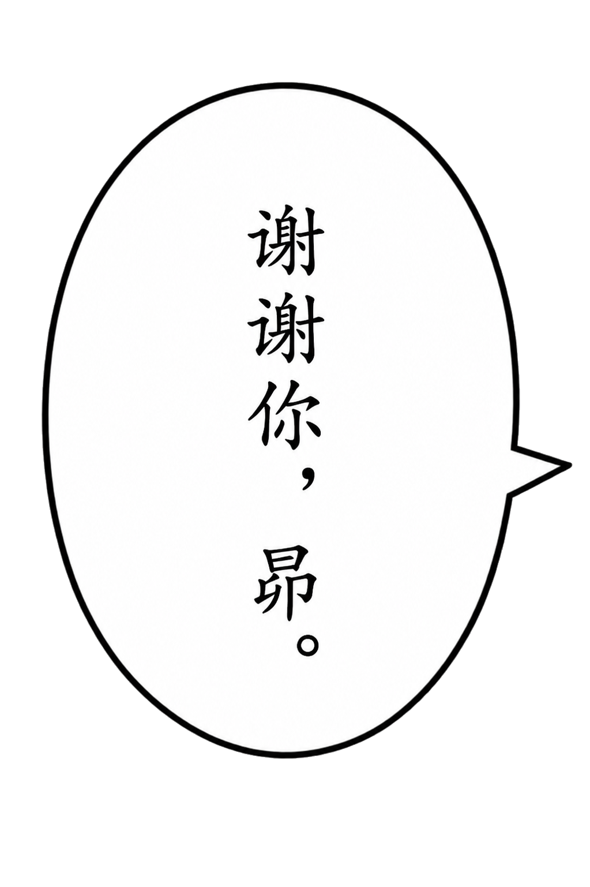
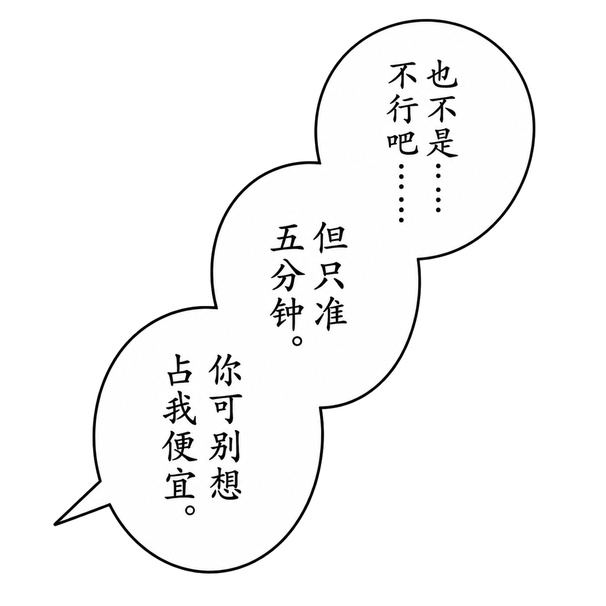
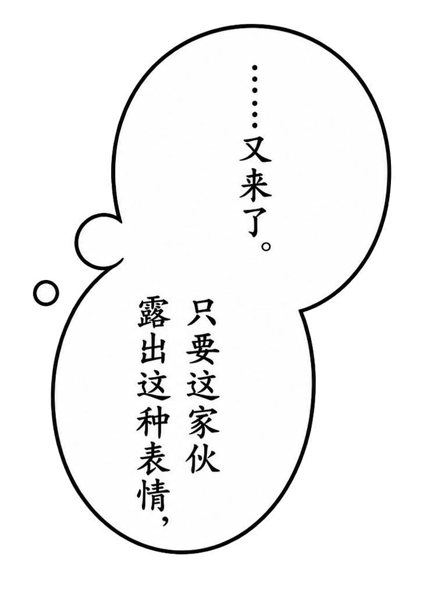
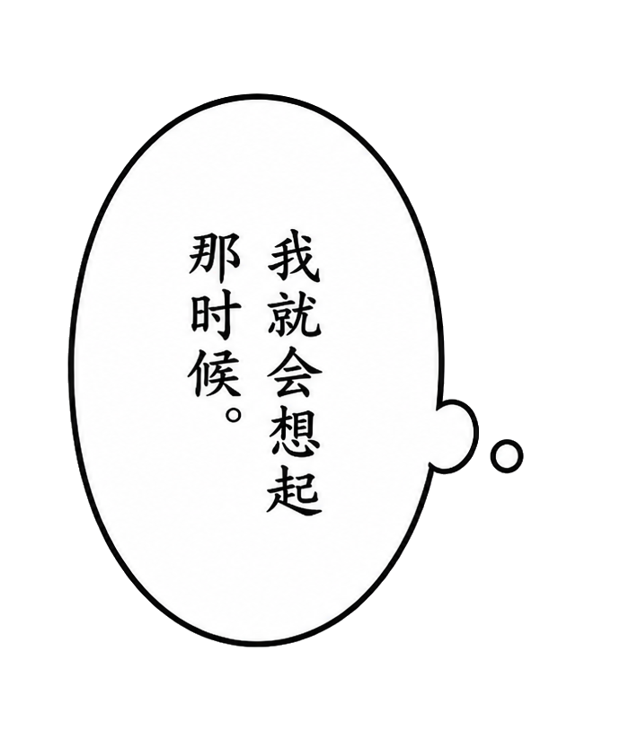
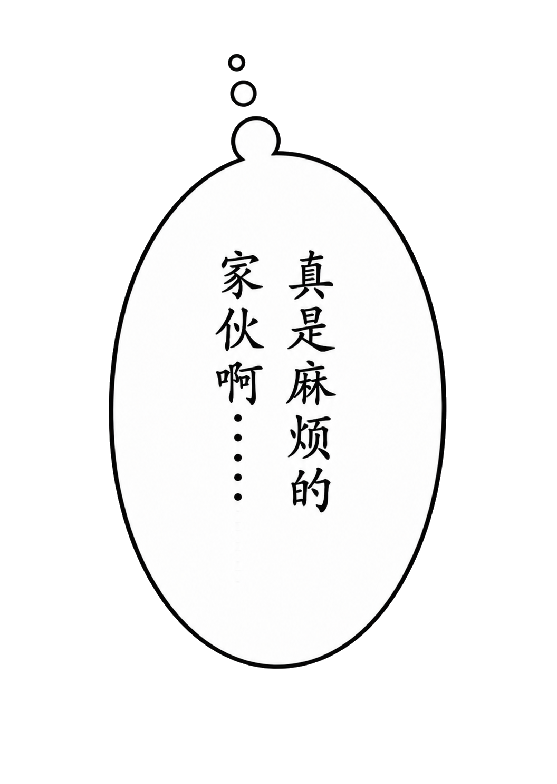
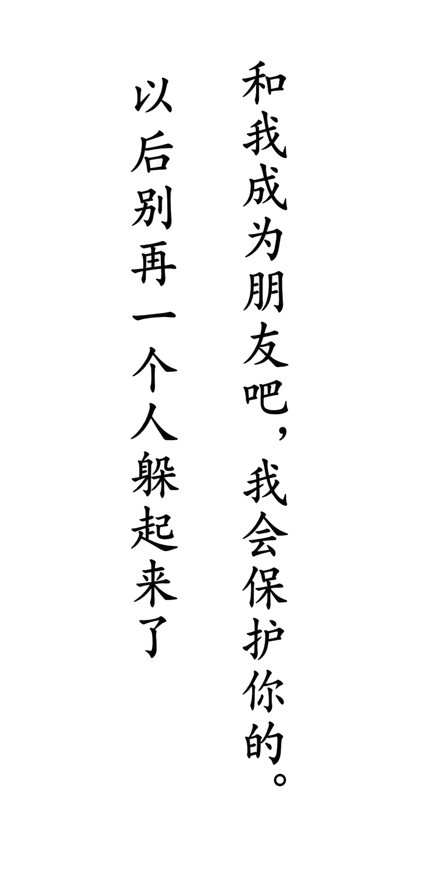
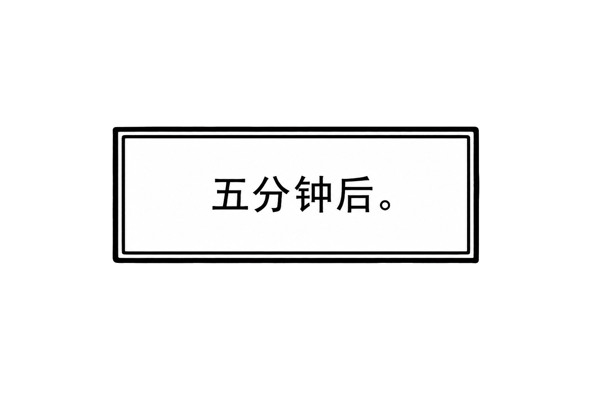
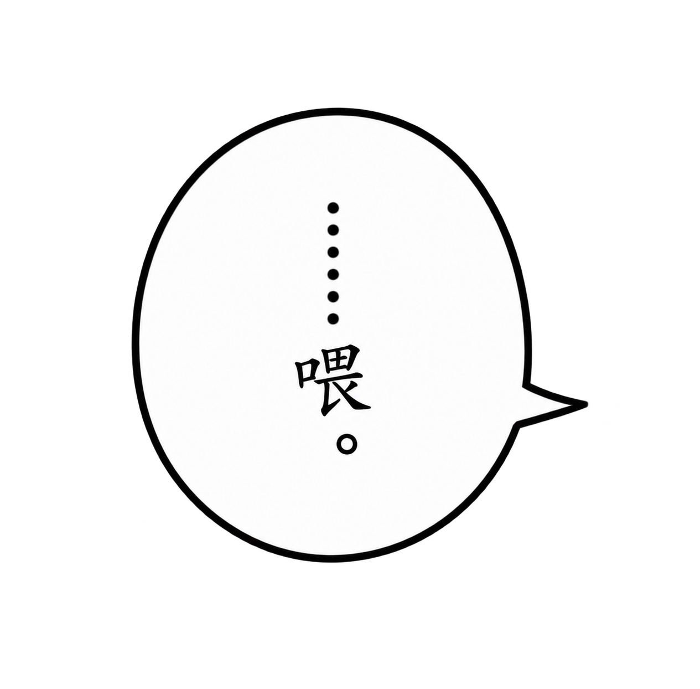
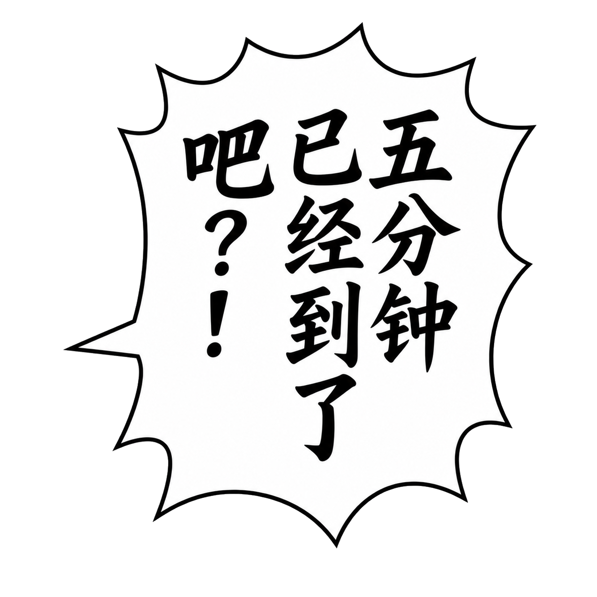
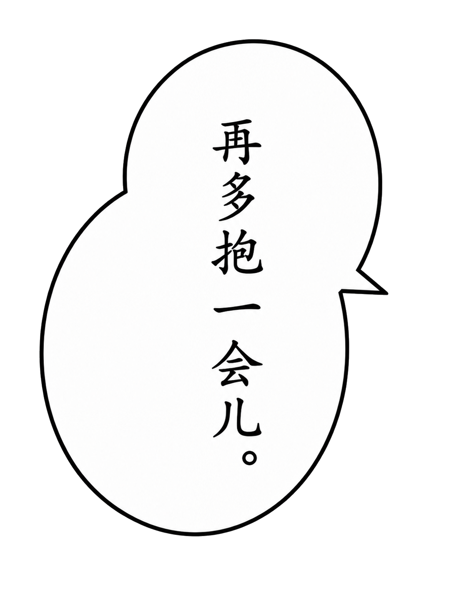

# 带字气泡：提示词与样式对照

[中文](lettering-styles.md) | [English](lettering-styles.en.md)

每个可独立移动的对象，一次完成文字、轮廓和尾巴。分镜画面保持独立，文字修改只需要替换相应对象。旁白框、心理活动、无框文字也使用同一对象层。

以下用 P10 的真实素材说明提示词怎样表达样式。英文片段来自当时模型调用或保存的生成记录；中文解释和末尾模板是本次整理。历史完整提示词见[附录](prompt-notes.md)。这些约束用于表达目标，出图后仍要检查字形、标点和透明度。

## 1 先写清对象边界

一张对象可以包含一句话，也可以包含有意一起移动的连接气泡。先确认哪些部分需要独立调整，再开始生成。

P10 的 C01 三段对白始终一起移动，所以生成一个三联对象。U02 的心理活动分布在人物两侧，需要分别取景，最终拆成 C03A 和 C03B 两个对象。相同说话人并不要求所有气泡合在同一张图中。

每个任务至少写明：

| 提示词部分 | 要写清什么 | 影响什么 |
| --- | --- | --- |
| 参考职责 | 气泡裁片负责形状，已通过对象负责字体风格 | 保持轮廓与前页字风连续 |
| 对象与轮廓 | 单枚、连接瓣数、圆润或不规则尖刺 | 气泡形态和阅读节奏 |
| 精确文字 | 逐字文本、标点、每瓣或每列分配 | 内容与排版 |
| 尾巴 | 尖尾或圆珠、方向、实际说话人 | 对话归属 |
| 字体与情绪 | 光学字号、笔重、笔势、留白、强调句 | 阅读舒适度和情绪张力 |
| 透明区域 | 外部透明，内部白色；无框文字只留字迹 | 能否干净覆盖画面 |
| 输出范围 | 独立完整对象、四周安全余量 | 能否在编辑器中自由移动 |

说话人和对象所在位置分开说明。跨格的心理活动应指向真正思考的人，即使旁边画着另一个角色。

## 2 圆润回应与三联对白

| C02 · 独立回应 | C01 · 三联对白 |
| --- | --- |
| [](../assets/text-objects/C02.png) | [](../assets/text-objects/C01.png) |

### C02：克制、清楚的日常回应

当时提示词的轮廓和尾巴约束：

```text
one isolated medium vertical ordinary Japanese manga speech balloon
calm rounded silhouette
one short pointed tail extending to the right
```

字风约束：

```text
elegant, soft, restrained, stable, and sincere
Consistent optical character size
Comfortable inner margins
```

竖向椭圆和短尖尾适合平静对白；均匀字号、较轻笔势和充足内边距使短句读起来稳定。柔和的手绘轮廓可有轻微不对称，整体仍保持清爽。

### C01：三句话连续说出，情绪有小变化

当时的结构约束：

```text
exactly three softly connected rounded lobes
arranged diagonally from upper-right to lower-left
one shared short pointed speech tail
```

每瓣对应一句，按右上 → 中间 → 左下阅读：

1. `也不是.....不行吧.....`
2. `但只准五分钟。`
3. `你可别想占我便宜。`

字风按整组统一，再作小幅情绪变化：

```text
Keep a consistent optical character size and stroke system throughout the connected group
First sentence is slightly tighter and lighter
third is only slightly heavier and firmer
```

第一句较轻、稍紧，体现犹豫；最后一句略重，表达嘴硬。张力通过笔重与节奏表达，同一组的单字大小保持一致。

## 3 心理活动：圆珠尾和跨格归属

| C03A · 右侧双联 | C03B · 左侧独立一句 |
| --- | --- |
| [](../assets/text-objects/C03A.png) | [](../assets/text-objects/C03B.png) |

C03 最初整体生成，后按创作者的移动需求拆成两张，保留文字和轮廓像素。新的创作任务可以提前规定“右侧双联与左侧独立气泡分别输出”，从生成阶段明确对象边界。

[](../assets/text-objects/C04.png)

C04 位于 A01 回忆镜头旁，但思考的人在上方 U02。它的生成记录专门写了归属与圆珠方向：

```text
this thought belongs to adult Subaru in the U02 panel above
Exactly three round thought-tail beads must emerge from the TOP
travel vertically upward/slightly upper-left, decreasing in size upward
```

这里用圆珠标记心理活动，三颗圆珠向上逐渐变小。尾巴方向同时要对照最后排版，避免指向回忆中的人物。

最终文字为 `真是麻烦的家伙啊.....`，末尾五个普通点。当时生成记录要求六点，后来创作者指定保留五点并做了局部覆盖修正。新作品使用最终文字约定直接生成；历史完整提示词仍原样保留。

## 4 无框纵排文字：只留字迹

[](../assets/text-objects/C05.png)

C05 的两句承诺作为一个文字对象进入 A02。形态约束：

```text
exactly one isolated transparent text-only object
two separate vertical columns
read the RIGHT column first and the LEFT column second
```

透明度约束：

```text
every pixel outside the black lettering must be genuinely transparent RGBA
```

右列是 `和我成为朋友吧，我会保护你的。`，左列是 `以后别再一个人躲起来了`。两列保持相同光学字号，右列字数较多所以更长。画面里的光线和星星属于分镜背景，文字对象只包含黑色字迹，字与字之间保持透明。

## 5 方框旁白：横排、平稳

[](../assets/text-objects/C06.png)

轮廓与排版约束：

```text
one isolated small horizontal rectangular manga narration box
compact upright Chinese manga narration lettering
horizontally arranged in one centered line from left to right
```

时间提示 `五分钟后。` 使用紧凑的横向方框，文字居中、笔势端正，框内保留白色。它在编辑器中仍是独立对象，可以放在适合阅读的位置。

## 6 平静、低声与大喊：同一字风下改变张力

| C07 · 克制的提醒 | C08 · 情绪高点 |
| --- | --- |
| [](../assets/text-objects/C07.png) | [](../assets/text-objects/C08.png) |

C07 的 `……喂。` 使用小而紧凑的圆润气泡，字形偏轻，提示词为：

```text
small compact rounded ordinary manga speech balloon
Small, thin-to-medium, low and restrained
```

C08 的 `五分钟已经到了吧？！` 是本页文字情绪高点。轮廓保留不规则、带圆角的尖刺，笔势更重、更有向前推动的节奏：

```text
lively uneven rounded-spike silhouette
heavier, sharper and slightly forward-driving
express force through stroke pressure, line rhythm and whole-block energy
```

同时约束 `consistent optical character size`，让张力集中在笔压、字形和整体节奏上。标点明确要求中文问号接中文叹号：`？！`。内边距要足够，尖刺和文字之间保持空隙。

[](../assets/text-objects/C09.png)

C09 的平静回应采用相连双瓣、柔和不对称的轮廓。提示词为 `softly connected rounded two-lobe balloon` 和 `calm, relaxed, affectionate and completely matter-of-fact`。它与 C08 形成情绪反差，同时保持同一页的笔画体系。

## 7 可用于自己作品的任务模板

下面是本次整理的填写模板：

```text
生成一个可独立移动的［对白／心理活动／旁白／无框文字］对象。
参考图一只控制轮廓、连接关系和尾巴；参考图二只控制已认可的字体与线条风格。
形态：［轮廓、瓣数、连接方向］。
精确文字：［逐字文本与标点］。
排版：［横排／竖排，列的顺序，每瓣分配，内边距］。
说话人和尾巴：［归属、尖尾／圆珠、方向和目标］。
字体：统一光学字号和笔画体系；［指定句］通过［字重、笔势、整体节奏］表现情绪。
输出：高分辨率 PNG，外部真实透明；气泡或旁白框内部纯白。
无框文字仅保留字迹。四周留安全余量，尖尾和圆珠完整可见。
只输出本对象；不带人物、场景、页面边框或额外文字。
```

历史例子采用中文竖排。为自己的英文漫画填写模板时，可明确设为横排、从左到右，并指定断行。分别确定分镜阅读路线与气泡内的文字方向，按自己的句子调整气泡比例；本案例素材保留原有文字。

生成后核对完整文字、标点、尾巴归属和实际透明通道，再交创作者确认。棋盘图案有时会被画进输出，不能只靠外观判定透明；P10 部分历史输出经过了有记录的外部背景透明处理，白色气泡内部继续保留。对象缩放会同时改变文字的阅读尺寸，初始化时要对照相邻对象的光学字号。

通过审核的素材作为完整对象装入编辑器。位置、范围和前后遮挡交给排版调整；字形已经确定，文字图片不做水平翻转。最终页面由本地导出直接生成。

[文字对象清单](text-objects.md) · [完整提示词](prompt-notes.md) · [返回全流程](full-workflow.md)
