# 分镜设计示例

[中文](storyboard-design.md) | [English](storyboard-design.en.md)

## 成品预览

| 页面示例一 | 页面示例二 |
| --- | --- |
|  |  |

这一节说明怎样把镜头描述整理成画面设计说明，再通过结构草稿确定页面框架。先写清表演和机位，确认每格的阅读顺序与文字位置，然后开始绘画。

## 1 描述想要的镜头

创作者先用文字描述每一格。下面选取两段实际提示词，可以看到人物站位、动作、表情和机位是怎样交代的。

近距离互动的描述节选：

> U01主要用来描绘昴有点害羞和尤里乌斯欲望拉满的张力情景，镜头主要是昴和尤里乌斯的上半身。昴整体在分镜右半边，昴身体朝左边，但是头偏向右边，脸颊微红，还有一滴因为害羞而出现的汗。昴的左手的食指挠着脸颊，一副有点紧张的样子。

拥抱镜头的描述节选：

> 尤里乌斯环住昴的腰肢，把头埋进昴的怀里去感受昴的气息，露出一半侧脸，尤里乌斯这时候是闭着眼睛的，脸颊微红，但是一脸享受的样子。而昴就单手抚摸着尤里乌斯的头，脸颊很红，但是表情很无奈。该分镜依然是尤里乌斯在左边，昴在右边，镜头从上斜着往下45度从侧面方向拍摄这个画面。

第一段确定了身体与头部的不同朝向，用挠脸动作表达害羞；第二段同时交代了环腰、摸头和俯拍角度。这样的描述能让绘画时需要保留的细节更清楚。

## 2 讨论动作与文字位置

ChatGPT 会先检查说话人、动作衔接和阅读顺序，再整理为可逐项确认的说明。当时的回复节选是：

> 这样才能保持说话人清楚，也符合右至左的阅读顺序。

讨论后，我们将两人的对白分别安排在对应人物附近，让气泡尾巴指向说话人；相邻镜头中的同一只手继续完成下一步动作。创作者还确认了镜头范围，以及两列无框文字的位置。

六个镜头使用固定工程编号。讨论、裁片、正式素材和编辑器都沿用同一编号，方便针对某一格修改：

| 工程编号 | 镜头 | 需要确定的画面内容 |
| --- | --- | --- |
| U01 | 开场近景 | 上半身范围、脸部距离、挠脸动作、三联气泡位置 |
| U02 | 拥抱主格 | 左右站位、侧上方俯拍、环腰与摸头的手部关系 |
| A01 | 暗色回忆 | 正面俯拍、完整蜷缩姿态、渐变暗背景 |
| A02 | 明亮回忆 | 低机位仰拍、伸手邀请动作、柔光和文字留白 |
| A03 | 表情特写 | 侧脸范围、眉眼和嘴形、独立小格位置 |
| U03 | Q 版收束 | 简化后的上半身互动、身高关系、反应文字与背景 |

## 3 形成画面设计说明

先安排主格与小格的关系，再细化镜头和文字位置。下面的结构图按当前参考工程的分镜形状、大小和位置绘制，六个编号可以直接在编辑器中找到。

[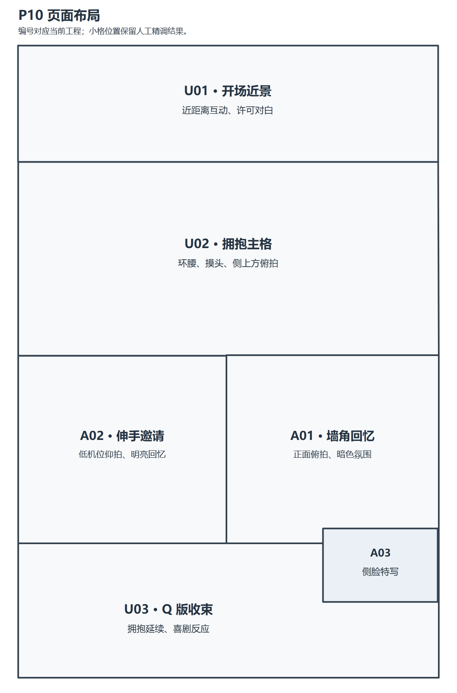](images/layout-guide.png)

U02 留出最大的表演空间；回忆层从右边 A01 读到左边 A02；底部 U03 延续互动，A03 小格叠在右侧。这张图展示最终人工精调的几何位置；草稿阶段选定的 FRAME-06 仍作为初始化框架来源保留。后期移动小格无需更换已经选中的表演。

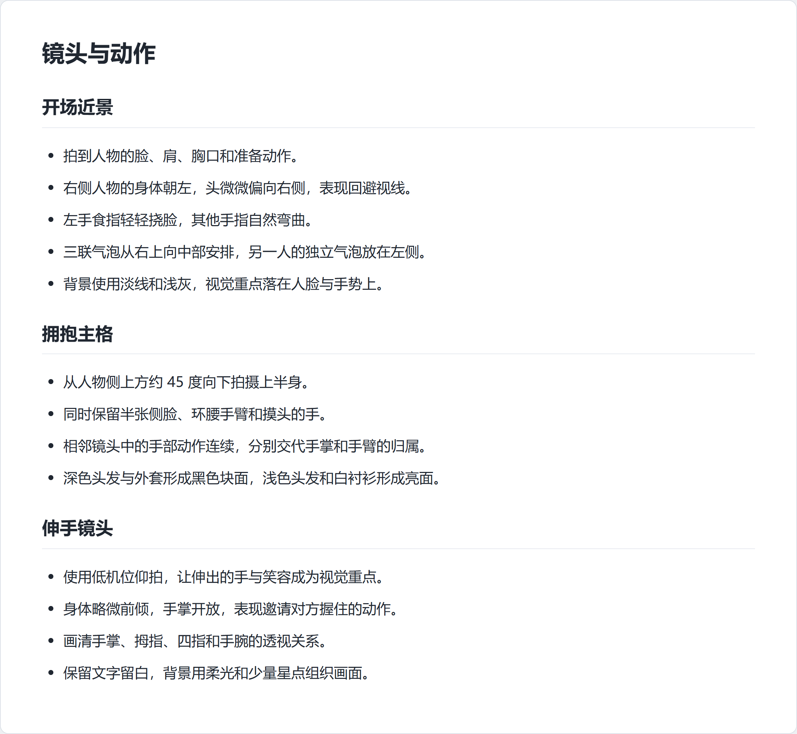

每个镜头同时确定取景、站位、手部关系和文字空间。逐格重绘时，按这些已经确认的内容继续细化。

## 4 给全部草稿编号，分别选框架和画面

Image 根据确认的画面说明独立生成多版结构草稿。编号总览把每个版本的框架和同类镜头并排展示：FRAME-01～FRAME-07 对应整页框架，A～F 对应六类镜头，末尾数字对应草稿版本。比如 A-03 表示第三版的开场近景，工程中的固定编号为 U01。

[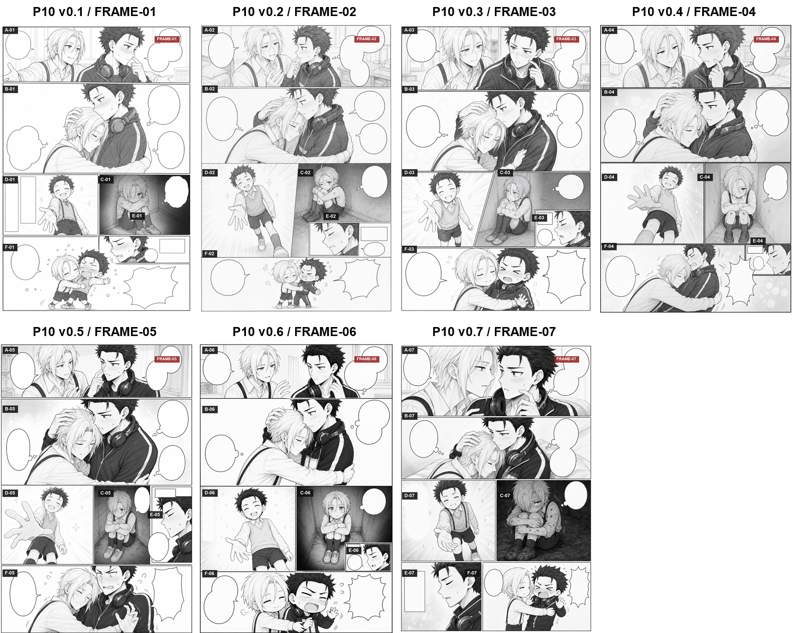](../storyboards/numbered/all-frames.png)

点击总览可查看大图。需要检查单格时，打开对应的编号页：[第一版](../storyboards/numbered/frame-01.png)、[第二版](../storyboards/numbered/frame-02.png)、[第三版](../storyboards/numbered/frame-03.png)、[第四版](../storyboards/numbered/frame-04.png)、[第五版](../storyboards/numbered/frame-05.png)、[第六版](../storyboards/numbered/frame-06.png)、[第七版](../storyboards/numbered/frame-07.png)。

选稿分两步完成：

1. **选整页框架。** 比较阅读顺序、主格面积、回忆层的空间、小格位置和文字留白。P10 选定 FRAME-06（v0.6）。
2. **逐格选表演。** 在所有版本中比较同类镜头的动作、表情、机位和人物辨识度，选出各格心仪的候选。每格可以来自不同版本。

P10 的实际选择如下：

| 固定工程编号 | 候选编号 | 候选版本 | 镜头 |
| --- | --- | --- | --- |
| U01 | A-03 | 第三版 | 双人开场近景 |
| U02 | B-04 | 第四版 | 拥抱主格 |
| A01 | C-06 | 第六版 | 墙角回忆 |
| A02 | D-06 | 第六版 | 伸手邀请 |
| A03 | E-02 | 第二版 | 侧脸特写 |
| U03 | F-07 | 第七版 | Q 版收束 |

当时的选稿指令是：

> 正式分镜为：A03,B04,C06,D06,E02,F07
> 正式分镜框架为：v0.6
> 请你先把对应分镜截下来，稍后我再指定分镜来进行正式版重绘

框架记录每格的初始形状和面积，内容来源表记录每格保留哪一版表演。锁定来源后，先裁出对应镜头保存，再让 Image 按单格参考正式重绘。

## 5 从选定裁片到正式分镜

下面展示全部六格的选定草稿裁片和最后使用的完整正式原图。左侧是动作、表情和机位参考，右侧是细化后的无字素材。点击图片可查看原尺寸。

### U01 · A-03 · 开场近景

| 选定线稿裁片 | 正式分镜原图 |
| --- | --- |
| [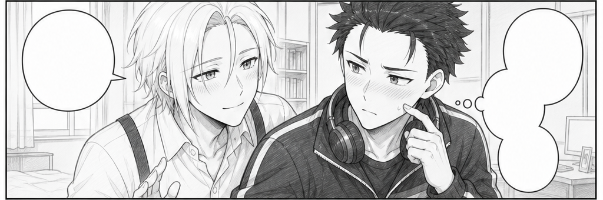](../storyboards/selected/U01.png) | [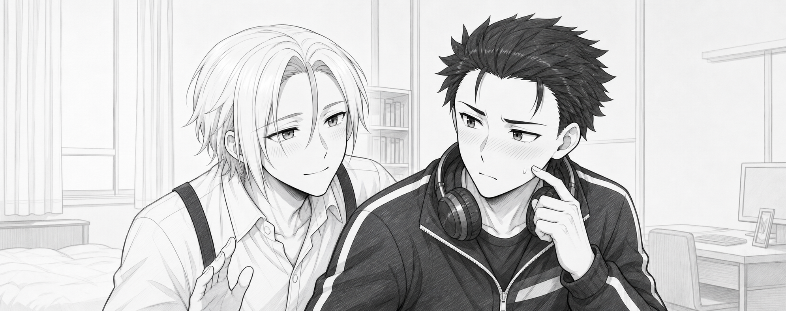](../assets/panels/U01.png) |

保留人物左右位置、近距离脸部关系、偏头和挠脸动作，再细化线条、衣服与简洁环境。

### U02 · B-04 · 拥抱主格

| 选定线稿裁片 | 正式分镜原图 |
| --- | --- |
| [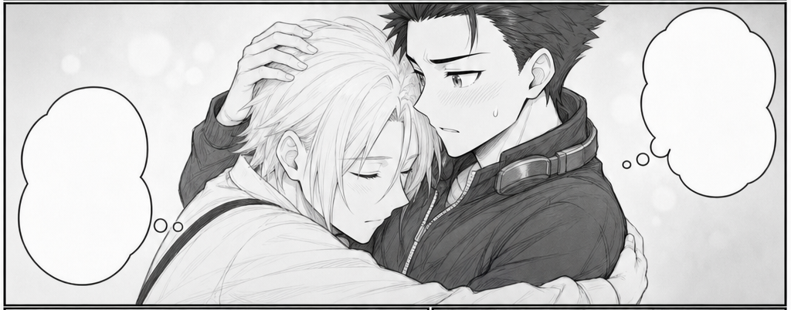](../storyboards/selected/U02.png) | [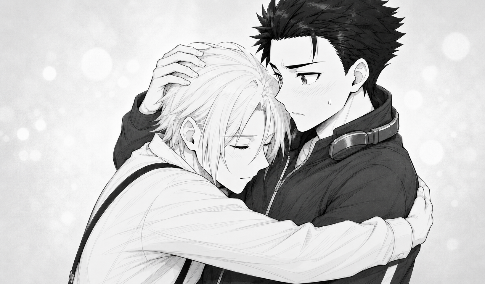](../assets/panels/U02.png) |

保护俯拍角度、环腰与摸头的手部关系、半露侧脸和原有表情。参考裁片负责表演，已确认的完成稿参考负责角色辨识度与画风。

### A01 · C-06 · 墙角回忆

| 选定线稿裁片 | 正式分镜原图 |
| --- | --- |
| [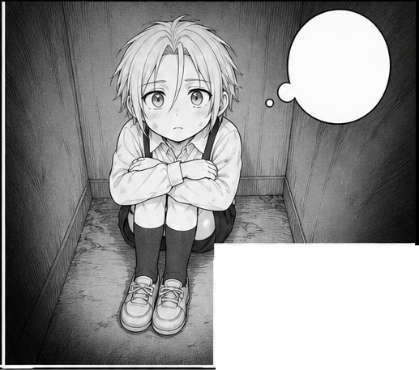](../storyboards/selected/A01.png) | [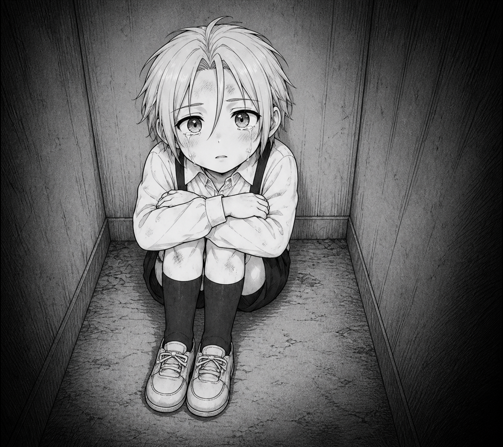](../assets/panels/A01.png) |

维持正面斜俯拍和蜷缩姿态，完成污渍、擦伤、刚哭过的泪光与暗色氛围。

### A02 · D-06 · 伸手邀请

| 选定线稿裁片 | 正式分镜原图 |
| --- | --- |
| [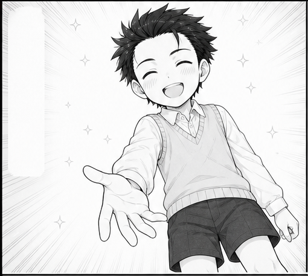](../storyboards/selected/A02.png) | [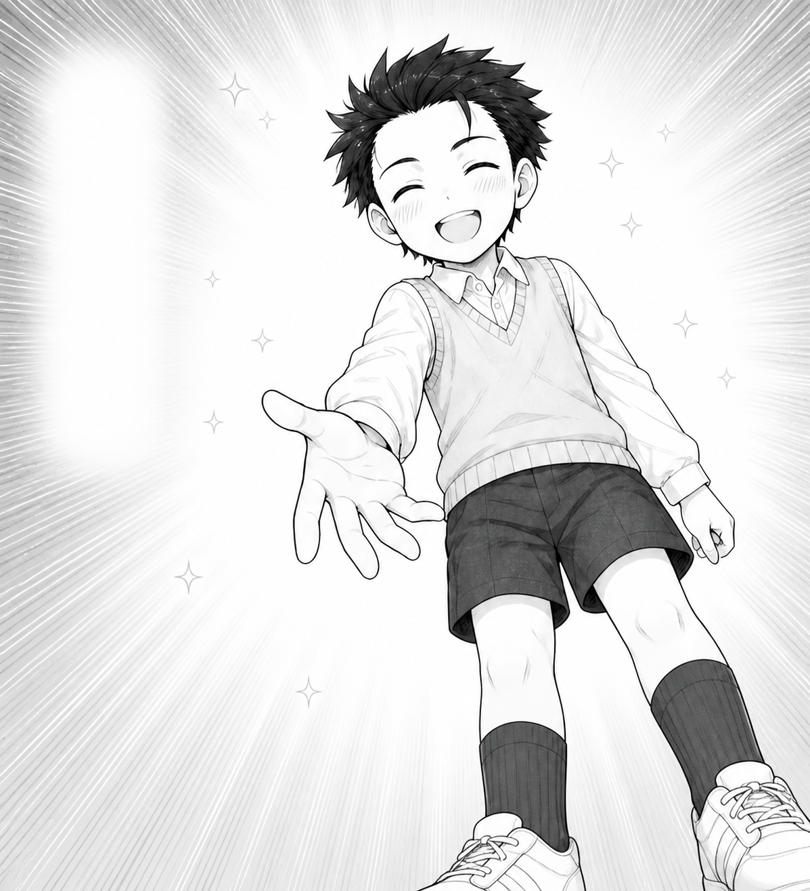](../assets/panels/A02.png) |

维持低机位仰拍、开朗笑容和邀请对方起身的伸手动作。画面保留明亮背景，承诺文字稍后以无框对象单独装配。

### A03 · E-02 · 侧脸特写

| 选定线稿裁片 | 正式分镜原图 |
| --- | --- |
| [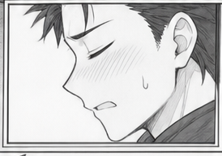](../storyboards/selected/A03.png) | [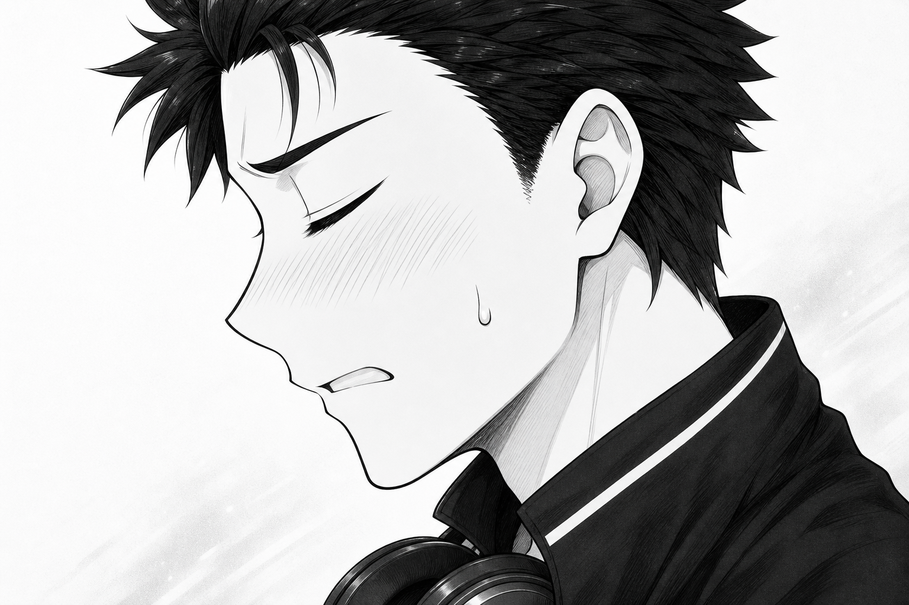](../assets/panels/A03.png) |

保留侧脸、闭眼和克制抱怨的表情，完整原图保留小格以外的内容，以便后续重新取景。

### U03 · F-07 · Q 版收束

| 选定线稿裁片 | 正式分镜原图 |
| --- | --- |
| [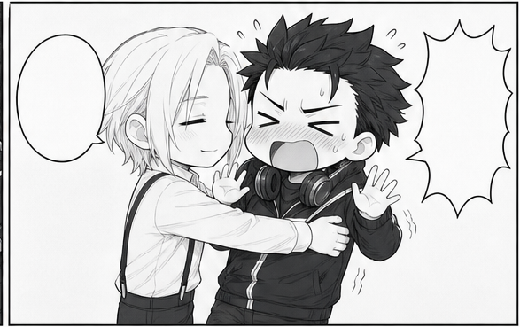](../storyboards/selected/U03.png) | [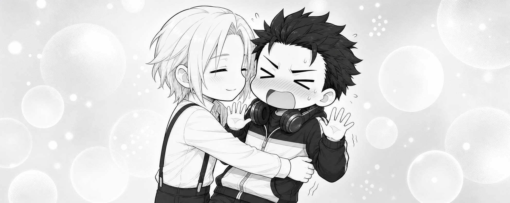](../assets/panels/U03.png) |

保留拥抱与后仰的喜剧反应，只展示上半身；细化时保持苗条的 Q 版比例、身高差、正确服装和柔和背景。狭长框架需要足够宽的正式画布。

### 怎样给 Image 发正式重绘任务

下面是供新作品填写的指令模板，具体台词和角色由自己的契约提供：

> 以［选定的单格线稿裁片］为动作、表情和机位依据，独立绘制［工程编号］的正式版本。严格保留人物站位、头部角度、视线、嘴形和手部接触关系。［已确认完成稿参考］只用于辨识度、服装和画风。按画面设计补足环境与细节，不绘制气泡、文字或页面边框。在能装入目标分镜的前提下，向四周补出可用取景余量；人物大小和景别保持原约定。

每格单独调用、单独保存。审核时先核对选稿来源和表演，再看手、衣服和环境。如果某一格需要修正，只替换该格素材；其他已通过的画格继续保留。

完整画布由编辑器的多边形遮罩裁切，框外内容留在原图中。拖动或缩放图片会改变取景，图片自身保持独立。带字对象也独立制作；其[提示词与样式对照](lettering-styles.md)在下一阶段说明。

## 6 写自己的画面描述

可以用这样的任务开始讨论：

> 这一页要表现［情绪或剧情变化］。我先描述每个镜头，请你检查动作连续性、人物站位、阅读顺序和气泡归属，再整理成画面设计说明。确认后我们再生成结构草稿。

每格可以写成一段话，也可以分项说明：

- 这一格要表达什么。
- 人物的位置、朝向和视线。
- 表情、身体动作和手部关系。
- 镜头范围、角度和背景。
- 台词、说话人、气泡位置和阅读顺序。

拿到整理结果后，逐格确认动作、景别和文字空间。按镜头位置指出需要修改的细节，确认后进入草稿阶段。

[查看完整提示词例子](<storyboard-description.txt>) · [案例素材使用说明](<../../ASSET-TERMS.md>)。
