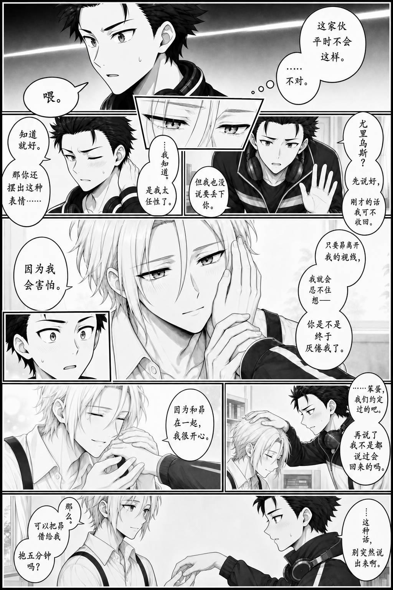
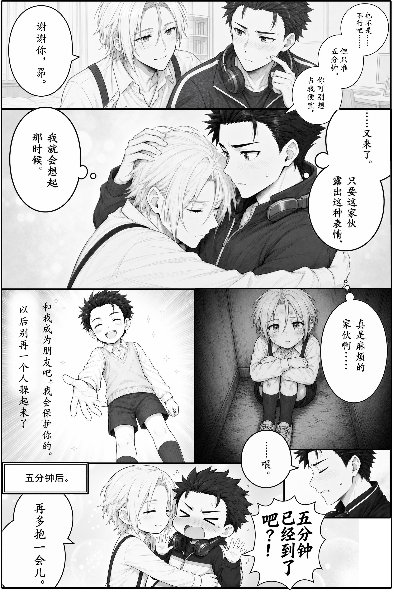

# PanelLoom

[中文](product-introduction.md) | [English](product-introduction.en.md)

Comic Creation Workflow & Manual Page Assembler.

| Page example 1 | Page example 2 |
| --- | --- |
|  |  |

PanelLoom helps creators collaborate with Codex to make a comic page. Discuss dialogue and shots, explore the page through layout drafts, select a framework and individual performances, then redraw each panel and generate independent lettered objects. Use the local editor to frame the artwork, arrange the page, and export at high resolution.

The creator decides the story, selects candidates, and approves the final result. ChatGPT organizes the agreed requirements, assists with asset generation, initializes the project, and checks its resources. The two examples above show results from this process; the second uses the creator's currently approved layout in the native editor.

## Compose → Separate → Assemble

Start with a full-page layout draft to establish reading order, camera angles, and space for text. Separate the selected panels into individual redraw tasks, and generate the final speech bubbles and lettering as independent assets. Assemble those complete assets into a page in the local editor.

Each retry affects one asset. A hand or expression can be corrected by redrawing that panel; dialogue or typography can be revised by replacing its lettered object. Accepted artwork stays available, and an unsuccessful asset can be replaced on its own.

During this comic's production, repeated whole-page image edits for lettering and small corrections introduced blur, noise, and changes in unrelated areas. Separating artwork and lettering reduced the need to regenerate the full page. Local composition also preserves the usable detail in the source images through export. Independent candidates, replaceable assets, and undoable layout changes make iteration more forgiving. Final quality comes from selection, panel-by-panel refinement, manual repairs where needed, and the creator's review.

## From dialogue to a finished page

| Stage | Decisions | Saved output |
| --- | --- | --- |
| Dialogue | Exact wording, speaker, emotion, and text container | Approved dialogue design |
| Visual design | Camera, placement, expression, action, and negative space | Shot and panel guide |
| Draft exploration | Page proportions, reading order, and acting candidates | Independent layout drafts |
| Numbered selection | Framework source and content source for each panel | Framework and panel source map |
| Finished artwork | Redraw from selected crops, with room for reframing | Complete panel images |
| Lettered objects | Bubble contour, tail, and final text in one asset | Independently movable text objects |
| Local assembly | Agent initialization, followed by creator adjustments | Working project and high-resolution export |

The [full P10 workflow](../P10/guide/full-workflow.en.md) documents these stages through real conversations in translation and their outputs, with Chinese originals retained for comparison. The [panel design chapter](../P10/guide/storyboard-design.en.md) shows numbered candidates, separate framework and content selection, and six draft-to-finished comparisons. The [lettering chapter](../P10/guide/lettering-styles.en.md) explains how prompts describe bubble shapes, tails, and typography. Each chapter links to its Chinese counterpart.

## Make the final adjustments on the canvas

Each panel is an independent polygon mask over a complete source image. Drag the image to reframe it, or adjust vertices and edges to change the panel shape. Bubbles can be clipped to one panel or displayed across panels. Their front/back relationship to an inset panel is a separate setting.

On the canvas, the mouse wheel scales the selected image or bubble. Ctrl + wheel zooms the whole page. In the property sidebar, the wheel scrolls the controls. Source artwork, text objects, and project parameters are stored separately; final export renders from the complete assets.

## Try the editor

The practice pack contains complete panels, text objects, an initial project, an approved reference project, and reference exports. Follow the [quick-start exercise](quick-start.en.md), beginning with P10 to practice framing, bubble placement, clipping, and occlusion. P09 provides a more complex main-panel/inset arrangement.

P10 includes 6 panels and 10 lettered objects. P09 includes 9 panels and 13 historical blank bubbles; its original finished page went through whole-page lettering and manual repairs. Native-editor reference exports and historical final pages are kept separately.

The artwork retains its original Chinese lettering. English instructions explain the workflow and controls without changing the images. The application interface remains in Chinese; the quick start pairs each relevant control with an English meaning.

Creator: bluecutt. AI collaborator: ChatGPT. See the [case asset terms](../ASSET-TERMS.en.md).
