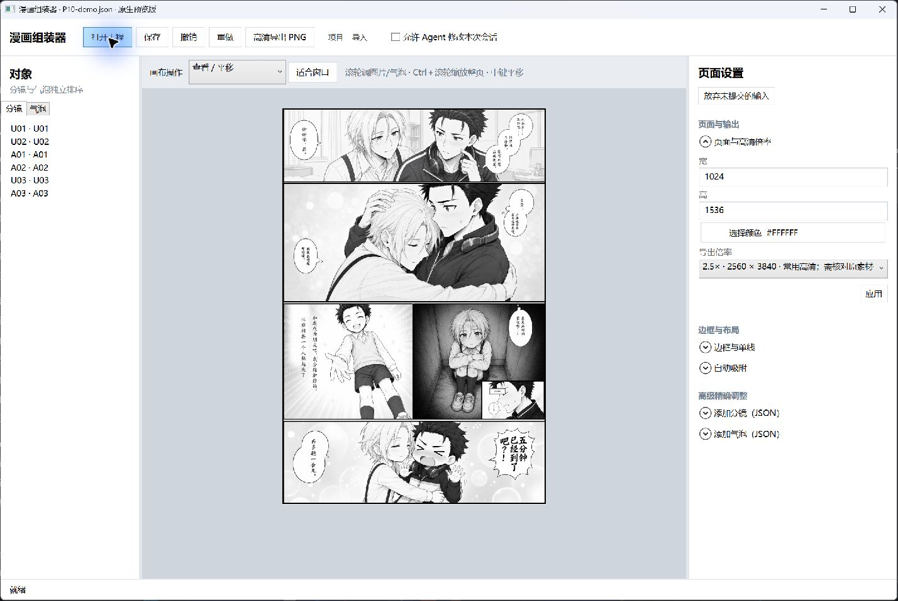
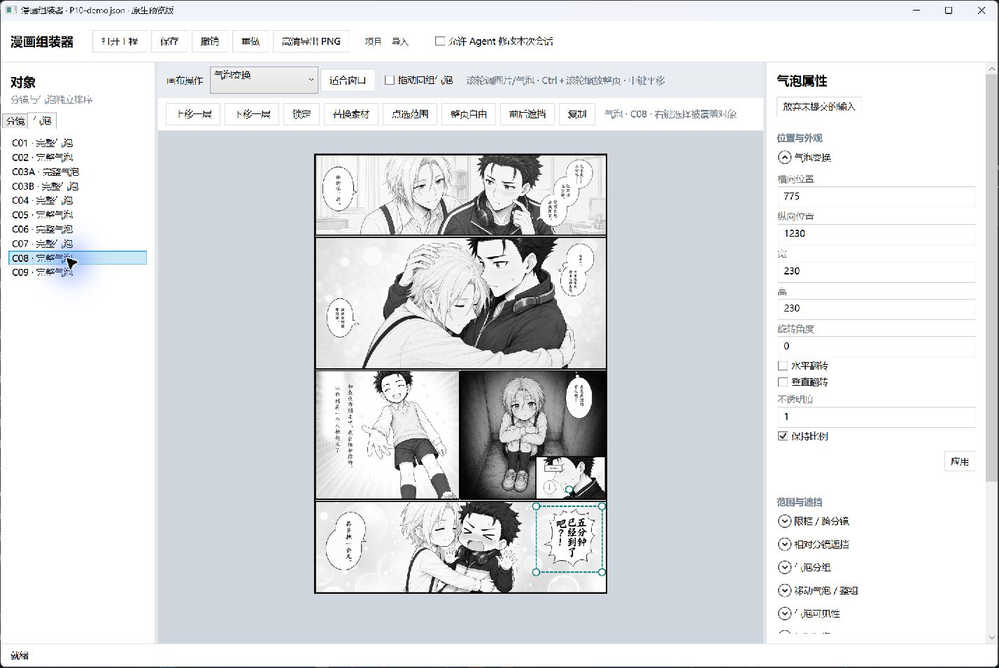
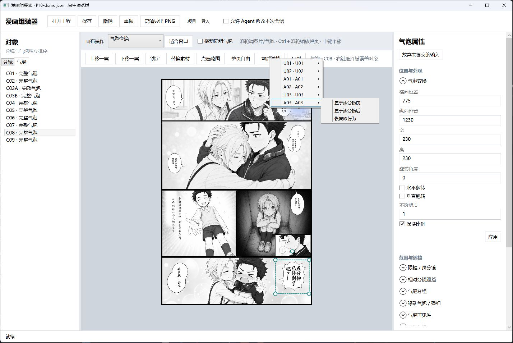
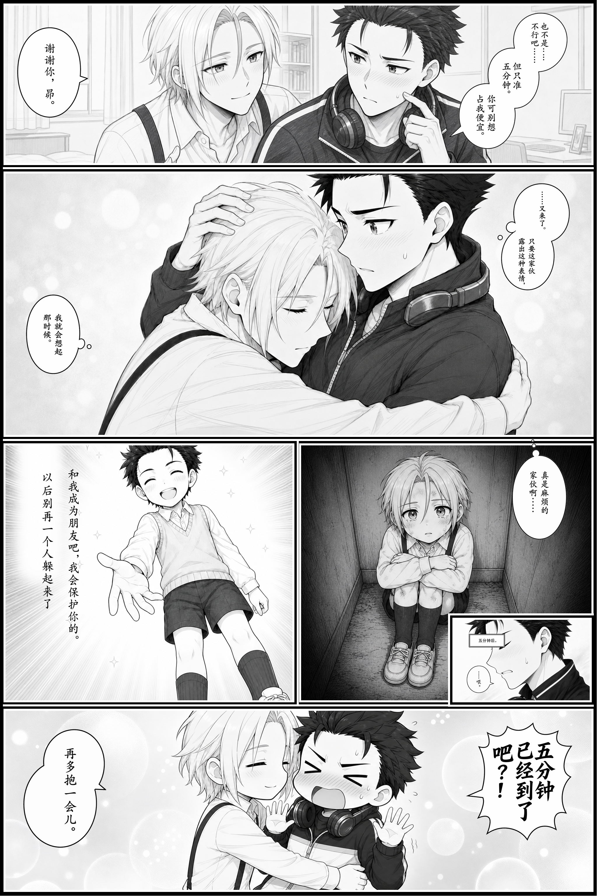

# 十分钟排版练习

[中文](quick-start.md) | [English](quick-start.en.md)

先解压 PanelLoom 应用文件夹和案例练习包，保留各自的完整目录。双击应用内的 `ComicEditor.exe`，打开案例包的 `P10/projects/reference.json`。先用“项目 → 另存为”，将工作文件保存到 `P10/work/working.json`；后续“保存”才写入这份工作副本。这个入口载入当前已确认的完整排版。

## 直接操作画布

1. 在左侧“分镜”列表选择一个分镜，切到“图片取景”。在画布内拖动图片，普通滚轮缩放当前图片；分镜框保持不变。
2. 按住 Ctrl 滚轮缩放整页，中键平移，点击“适合窗口”恢复全页视图。右侧属性区的滚轮只滚动侧栏。
3. 切到“顶点”或“边线”模式，拖动画布控制点或边线，调整分镜形状。框架之外的原图仍保留，随时可重新取景。
4. 在“气泡”列表选择 C08，即“五分钟已经到了吧？！”的炸裂气泡。在画布拖动或滚轮缩放，观察文字与画面的关系。
5. 点击“整页自由”让气泡跨格显示；“点选范围”可以直接点画布上的目标分镜，将超出部分隐藏。
6. 点击“前后遮挡”，在分镜菜单中选择 A03，再选择“置于该分镜前”或“置于该分镜后”。气泡可以跨格，同时被小格遮挡。工具会反馈需要调整的层级；其他对象之间的顺序保持原样。
7. 点击“上移一层”“下移一层”，可调整同类对象顺序。每一步都可以撤销。
8. 保存到工作文件，点击“高清导出 PNG”，选择预设倍率并核对输出尺寸，保存到 `P10/output/`。

起始工程和参考工程用作固定对照，打开后先另存工作文件，保留这两份基准。P10 的参考工程保留单线边界与 2× 输出，实际为 2048×3072。P09 参考工程为 2×，实际也为 2048×3072。高倍率从完整素材重新绘制；像素不足时保留质量提示。

## 对照参考

以下截图来自初始化练习工程的隔离副本，展示当前原生预览版的实际操作界面。精调后的布局见下方对照和参考工程。

选择独立带字气泡后，画布显示可直接拖动的控制框。原素材保持完整。

同一个气泡可分别设置显示范围与相对分镜遮挡。菜单列出目标分镜，并提供前、后与恢复原行为三种选择。

`reference-output/editor-reference.png` 与 `projects/reference.json` 配对，使用创作者已确认的新原生编辑器布局，保留气泡裁切、前后遮挡、框架位置和输出倍率。`projects/start.json` 保留历史初始化布局，可单独打开比较人工调整前后的变化。`historical-final.png` 展示当时确认的历史成品。

| 初始化布局 | 精调后的参考布局 |
| --- | --- |
|  |  |

P09 提供空白气泡，可练习对象定位、跨格裁切和遮挡。使用练习素材时仅进行本地非破坏性排版，并保存本地结果。

[案例介绍](product-introduction.md) · [P10 全流程](../P10/guide/full-workflow.md) · [Agent 操作](agent-appendix.md) · [素材使用说明](../ASSET-TERMS.md)
