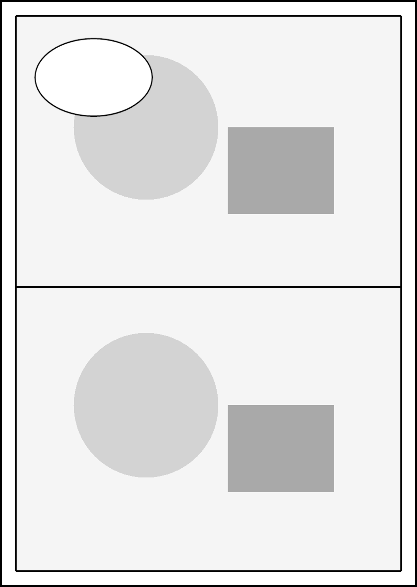

# 快速上手

[中文](quick-start.md) | [English](quick-start.en.md)

使用 Windows x64 免安装文件夹。保留配套 DLL、文档与示例，双击 `ComicEditor.exe`。

## 打开并调整

1. 点击“打开工程”，选择 `examples/minimal-page/project.json`。先用“项目 → 另存为”创建新的工作文件，后续“保存”写入该工作副本。
2. 在分镜列表选择上格，在画布中拖动图片；普通滚轮缩放当前图片。按住 Ctrl 滚轮缩放整页，中键平移。右侧滚轮滚动属性面板。
3. 切换到顶点或边线工具，直接拖动画布上的控制点或边。分镜框变化只改变取景，原图仍完整保存。
4. 切换到气泡列表，选中气泡后在画布拖动、缩放。范围选择该分镜可隐藏超出部分，选择“整页自由”可跨格显示。
5. 用“前后遮挡”指定气泡与目标小格的关系。范围和遮挡分别调节；状态栏反馈自动上移或下移的层数。一次操作可以撤销。
6. 保存工程，点击“高清导出 PNG”。选择 1×、2×、2.5×或3×，核对界面显示的输出尺寸。原素材像素不足会给出质量提示。

模板示例用于验证操作，源图像素有限。较高导出倍率保留可用细节，无法补出缺失细节。实际创作导入完整原图。

## 在 Codex 中开始

将 `skills/comic-page-workflow` 复制到自己创作项目下的 `.agents/skills/comic-page-workflow`，准备项目配置与自己的契约。可参考 Skill 内的 `assets/project-config-example.json`，将编辑器路径指向本机免安装目录，契约路径指向自己的文档。具体步骤见 [Codex 设置](codex-setup.md)。

> 请使用 $comic-page-workflow，读取项目配置、当前剧情和角色画风契约。先为这一页整理台词初稿，标注说话人、气泡类型、阅读顺序与情绪。我确认后再设计画面。

需要 Agent 初始化时，提供已确认框架、完整图像和独立带字对象。见 [Agent 操作](agent-workflows.md)。正在使用的工程先获取实时快照，按窗口中的授权开关决定是否可写。

进入 [完整创作流程](page-workflow.md)，了解每一步的输入和产物。素材授权见 [许可与素材](licensing.md)。
